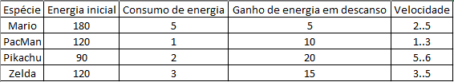

No que toca à implementação dos rankings, usufruímos do bubble sort, aprendido em AED para ordenar dois arrays distintos, um de posições e outro de IDS.
Desta forma, quando há posições iguais, verificamos se no outro array os IDS estão na ordem correta, se não tiverem, trocamos, e por fim damos "set" no rank.

https://youtu.be/IqP12LQbkXk

Efetuámos personalização ao nosso jogo, de forma que ele parecesse mais "retro".
Desta forma adicionámos personagens dos jogos clássicos, como o Mario, o Link, o fantasma do Pac Man e o Pikachu.
Mudámos também os alimentos já fornecidos, para algo que se mantivesse no tema pretendido.

No que toca às espécies a escolha foi muito simples, o fantasma é mais lento por isso reduzimos a velocidade e o consumo de energia, mas começa com uma quantidade de energia mais generosa.
O Pikachu é mais ágil e pequeno por isso possui uma velocidade maior e recupera mais facilmente, em contra partida possui menos energia inicial.
O Mario possui muita energia inicial porque ele passa o tempo todo a correr nos seus jogos, mas consome mais energia por ser barrigudo, a velocidade é "média" por ser um ser humano.
O Link possui uma energia equilibrada e um consumo de energia um pouco maior, mas compensa com um bom ganho de energia, a velocidade é parecida à do mario devido a serem ambos humanos.